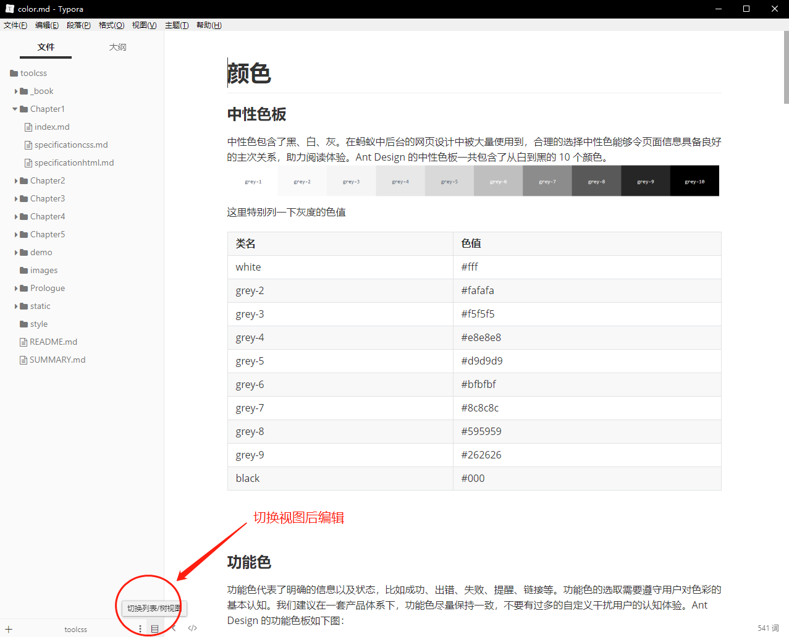

为了方便大家快速布局，标准化基本样式的目的。我把自己常用的css和规范做了个基本的梳理，分享给大家使用。包括布局、颜色、排版等常用模块。

项目引用:
```bash
yarn add less-loader less --save-dev 
yarn add toolcss
```
或者

```bash
npm install  less-loader less --save-dev
npm install toolcss -S
```

在vue中引用：
```javascript
//普通引用
import 'toolcss/toolcss.css' 
//不带mixin的全功能版本：
import 'toolcss/toolcss_full.css' 
//只引用mixin：
import 'toolcss/toolcss_mixin.less' 
//全量引用请:
import 'toolcss/toolcss_max.less'  
```


#### 编辑此文档：
文档clone下来了请这样启动

```bash
yarn global add gitbook-cli

yarn install

gitbook install

##每次增加文件之后需要重新执行如下两步

gitbook init

gitbook serve
```


本库的文档 由gitbook编纂而成  欢迎大家push 增加功能  修改错误  

markdown建议使用 [typora](https://www.typora.io/) 编辑




2019年1月2日  何  勋
