# 颜色

### 中性色板

中性色包含了黑、白、灰。在蚂蚁中后台的网页设计中被大量使用到，合理的选择中性色能够令页面信息具备良好的主次关系，助力阅读体验。Ant Design 的中性色板一共包含了从白到黑的 10 个颜色。

这里特别列一下灰度的色值

| 类名   | 色值    |
| ------ | ------- |
| white  | #fff    |
| grey-2 | #fafafa |
| grey-3 | #f5f5f5 |
| grey-4 | #e8e8e8 |
| grey-5 | #d9d9d9 |
| grey-6 | #bfbfbf |
| grey-7 | #8c8c8c |
| grey-8 | #595959 |
| grey-9 | #262626 |
| black  | #000    |

### 功能色

功能色代表了明确的信息以及状态，比如成功、出错、失败、提醒、链接等。功能色的选取需要遵守用户对色彩的基本认知。我们建议在一套产品体系下，功能色尽量保持一致，不要有过多的自定义干扰用户的认知体验。Ant Design 的功能色板如下图：

| 类名        | 功能色 |
| ----------- | ------ |
| col-link bg-link    | 链接   |
| col-success bg-success| 成功   |
| col-warning bg-waring| 警告   |
| col-error bg-error| 错误   |

### 基础色板

这里借用了Ant Design 的基础色板共计 120 个颜色，包含 12 个主色以及衍生色。这些颜色基本可以满足中后台设计中对于颜色的需求。

Dust Red / 薄暮斗志、奔放

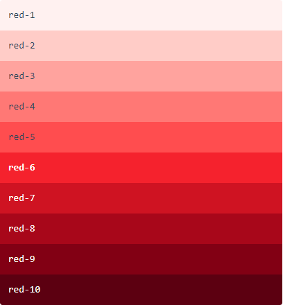

Volcano / 火山醒目、澎湃

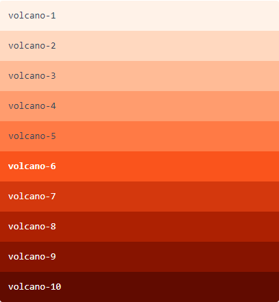

Sunset Orange / 日暮温暖、欢快

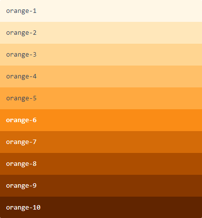

Calendula Gold / 金盏花活力、积极

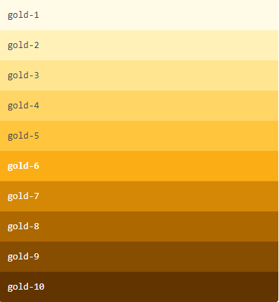

Sunrise Yellow / 日出出生、阳光

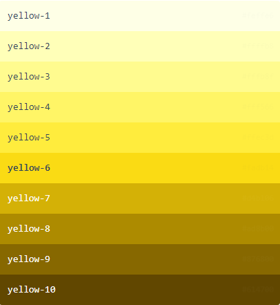

Lime / 青柠自然、生机

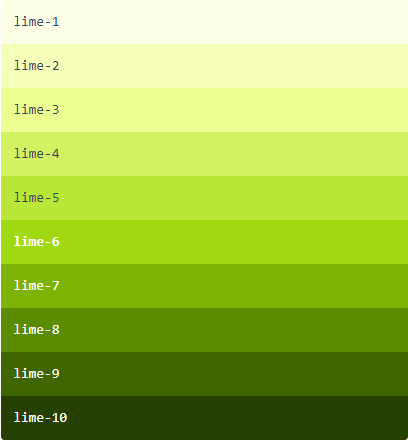

Polar Green / 极光绿健康、创新

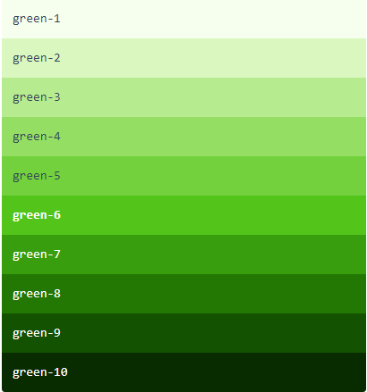

Cyan / 明青希望、坚强

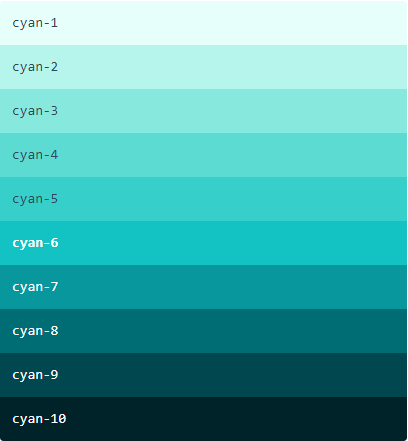

Daybreak Blue / 拂晓蓝包容、科技、普惠

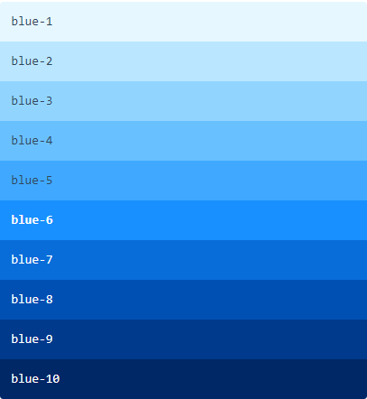

Geek Blue / 极客蓝探索、钻研

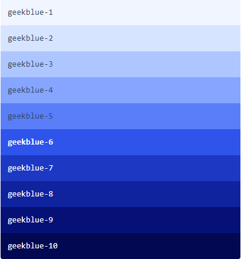

Golden Purple / 酱紫优雅、浪漫

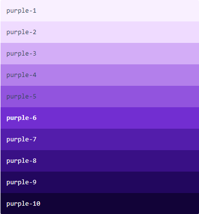

Magenta / 法式洋红明快、感性

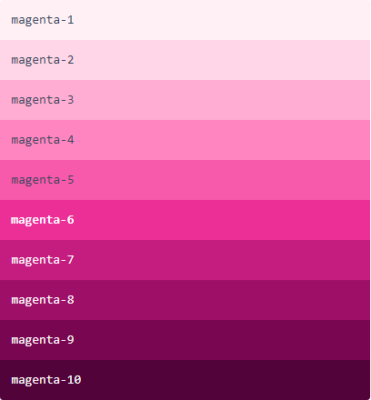

